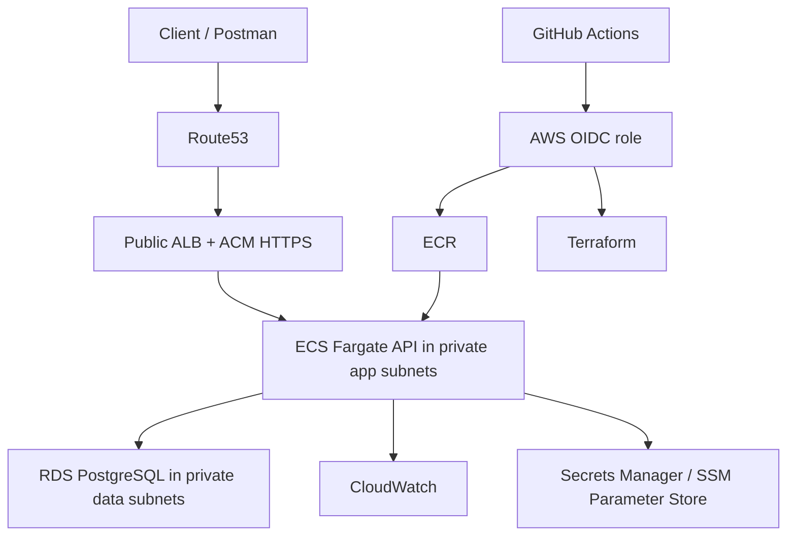

# TransitOps Cloud Architecture

## Purpose

This document is the single cloud reference for TransitOps. It defines the target AWS topology, shared conventions, and Terraform remote-state bootstrap path used by the cloud work.

## Target AWS Topology

TransitOps remains a single stateless backend API deployed behind a standard AWS ingress path.



Selected services:

- Route53 and ACM for DNS and HTTPS.
- ALB as the only public application ingress.
- ECS Fargate for the API runtime.
- ECR for container images.
- RDS PostgreSQL for persistence.
- CloudWatch for logs, metrics, dashboards, and alarms.
- Secrets Manager for secrets.
- SSM Parameter Store or Terraform environment variables for non-secret runtime configuration.
- GitHub Actions with AWS OIDC role assumption for CI/CD. Long-lived AWS access keys are not part of the intended steady-state path.

Explicit non-goals for this project stage:

- microservices;
- Kubernetes/EKS;
- multi-region failover;
- service mesh;
- public ECS tasks;
- public RDS access;
- separate queueing/event-driven subsystems.

## Network And Security Model

Each deployed environment gets one VPC across at least two availability zones.

Subnet layout:

- public subnets for ALB and NAT;
- private app subnets for ECS tasks;
- private data subnets for RDS.

Traffic model:

1. public application ingress enters through the ALB;
2. ALB forwards only to ECS targets;
3. ECS connects privately to RDS;
4. RDS accepts PostgreSQL traffic only from the ECS security group.

Security-group intent:

- ALB security group accepts public HTTP ingress in `dev` until a real domain/certificate exists, and public HTTPS ingress when ACM/Route53 are enabled.
- ECS security group accepts only ALB-to-container traffic.
- RDS security group accepts only ECS-to-PostgreSQL traffic.

Initial `dev` posture:

- ECS desired count: `1`;
- RDS: `Single-AZ`;
- RDS automated backup retention: `0` days for disposable educational `dev` runs;
- NAT gateway: `1` to keep ECS private while controlling cost.
- planned hostname: `api.dev.transitops.net`.

The Terraform runtime module supports both HTTP-only development plans and the target HTTPS path. With the Route53 hosted zone for `transitops.net` available, the `dev` plan enables ACM certificate validation, Route53 records, HTTP-to-HTTPS redirect, and HTTPS listener `443` for `api.dev.transitops.net`. If the hosted zone is not present in the target AWS account, the first deployment uses the ALB DNS name over HTTP and keeps HTTPS disabled until DNS is delegated into the account.

## Naming, Tags, And Environments

Fixed constants:

- Project slug: `transitops`
- Service slug: `api`
- Default region: `eu-west-1`
- First deployed environment: `dev`
- Reserved future environment: `prod`

Default naming pattern:

```text
<project>-<environment>-<component>
```

Examples:

- `transitops-dev-vpc`
- `transitops-dev-alb`
- `transitops-dev-api-svc`
- `transitops-prod-db`

Common resource names:

| Resource | Convention |
| --- | --- |
| VPC | `<project>-<env>-vpc` |
| Public subnet | `<project>-<env>-public-<az>` |
| Private app subnet | `<project>-<env>-app-<az>` |
| Private data subnet | `<project>-<env>-data-<az>` |
| ALB SG | `<project>-<env>-alb-sg` |
| ECS SG | `<project>-<env>-ecs-sg` |
| RDS SG | `<project>-<env>-rds-sg` |
| ECS service | `<project>-<env>-api-svc` |
| RDS instance | `<project>-<env>-db` |
| ECR repository | `<project>/api` |
| CloudWatch log group | `/aws/ecs/<project>/<env>/api` |
| Terraform state bucket | `<project>-tfstate-<account-id>-<region>` |
| Terraform lock table | `<project>-tfstate-locks` |

Mandatory tags for taggable resources:

| Tag | Example |
| --- | --- |
| `Name` | `transitops-dev-alb` |
| `Project` | `TransitOps` |
| `Environment` | `dev` |
| `ManagedBy` | `Terraform` |
| `Owner` | `pey` |
| `Repository` | `pey-45/TransitOps` |
| `ResourceGroup` | `transitops-dev` |
| `Service` | `api` or `platform` |
| `TerraformStack` | `transitops-dev` |

`ResourceGroup` and `TerraformStack` are intentionally stable cleanup tags. In AWS Resource Explorer/Resource Groups, filtering by `tag:TerraformStack = transitops-dev` identifies the resources Terraform created for the `dev` stack; filtering by `tag:TerraformStack = transitops-bootstrap-remote-state` identifies the remote-state bootstrap resources that are intentionally outside the environment destroy cycle.

Environment rules:

- `dev` and `prod` must have separate Terraform state keys, VPCs, ECS services, RDS instances, secret namespaces, DNS records, and CloudWatch namespaces.
- `api.dev.<root-domain>` is the intended dev hostname.
- `api.<root-domain>` is the intended prod hostname.
- AWS deployments should run the app with `ASPNETCORE_ENVIRONMENT=Production`; environment identity comes from AWS names, tags, DNS, and runtime configuration.

## Runtime Configuration And Secrets

Runtime settings must be externalized. Secrets must not be committed.

Preferred placement:

| Setting Type | Store |
| --- | --- |
| Database connection string | Secrets Manager |
| JWT signing key | Secrets Manager |
| Bootstrap admin token | Secrets Manager |
| JWT issuer/audience/expiration | SSM Parameter Store or Terraform environment variables |
| Non-secret operational settings | SSM Parameter Store or Terraform environment variables |

.NET configuration keys should keep the existing double-underscore shape:

- `ConnectionStrings__DefaultConnection`
- `Jwt__Issuer`
- `Jwt__Audience`
- `Jwt__SigningKey`
- `Jwt__ExpirationMinutes`
- `Bootstrap__FirstAdminToken`

AWS migrations should not depend on API startup side effects. The later deployment path should run EF Core migrations explicitly as a deployment step or dedicated task.

Sprint 4 fixes that deployment model as a one-off ECS task. The API image supports a `--migrate-only` command that builds the normal application services, applies EF Core migrations through `TransitOpsDbContext.Database.Migrate()`, and exits without starting the HTTP server. GitHub Actions runs that command with `aws ecs run-task` inside the private app subnets, so migrations can reach the private RDS instance without exposing the database publicly.

## Terraform Runtime Layer

Sprint 3 encodes the AWS runtime path as Terraform, but it does not apply it yet.

Reusable modules:

- `container_registry`: creates the ECR repository for the API image, enables image scanning on push, and applies a basic image retention policy.
- `observability`: creates the CloudWatch log group consumed by ECS container logs.
- `database`: creates the private RDS PostgreSQL baseline, DB subnet group, and DB parameter group using the data subnets and RDS security group from the foundation module.
- `runtime_config`: defines the Secrets Manager and SSM Parameter Store contract for runtime configuration without committing secret values.
- `container_runtime`: creates ECS cluster, task execution role, task role, task definition, ECS service, ALB, target group, HTTP listener, health check, and optional future HTTPS/ACM/Route53 wiring.
- `github_oidc`: creates the GitHub Actions OIDC trust path and the `transitops-dev-github-actions-deploy-role` role used by CI/CD without long-lived AWS keys.

The `dev` environment wires these modules to the Sprint 2 foundation outputs:

- ALB uses `public_subnet_ids`.
- ECS service uses `app_subnet_ids`.
- RDS uses `data_subnet_ids`.
- Security groups come from the foundation module: ALB -> ECS -> RDS.
- Common tags and service tags come from the same Terraform convention outputs.

The API container contract is:

- container port: `8080`;
- container shutdown timeout: `30` seconds in ECS task definition;
- readiness path: `/api/v1/health/ready`;
- launch type: ECS Fargate with `awsvpc` networking;
- logs: JSON console output shipped to CloudWatch through the `awslogs` driver;
- request correlation: every response includes `X-Correlation-ID`; callers may provide that header, otherwise the API generates one and uses it as the response metadata request id and log correlation value;
- .NET configuration keys keep the existing `__` environment-variable shape;
- secrets are referenced by ARN from Secrets Manager, never embedded in Terraform values.

## Observability Baseline

Sprint 6 fixes the minimum operational telemetry surface for `dev`.

Application logging:

- ASP.NET Core writes JSON console logs so CloudWatch can parse fields.
- The API correlation middleware records method, path, status code, elapsed time, authenticated user id, role, and `State.CorrelationId` for each request.
- Error responses and success envelopes use the same correlation id in `meta.requestId`.

CloudWatch resources:

- log group: `/aws/ecs/<project>/<env>/api`;
- dashboard: `<project>-<env>-api`;
- metric filter: application `Error` and `Critical` JSON log entries;
- alarms: application errors, ALB target `5XX`, ALB target response time, unhealthy ALB targets, ECS CPU, ECS memory, RDS CPU, RDS connections, and RDS free storage;
- optional SNS email alarm notifications through `alarm_email`.

Deployment hardening:

- ECS deployment circuit breaker rollback is enabled.
- ALB target health-check settings and ECS health-check grace period are explicit Terraform variables.
- `dev` keeps a short target deregistration delay to speed up deployment replacement while still allowing request draining.
- ECR uses `force_delete = true` in `dev` so final Terraform destroy can remove the repository even after Sprint evidence images were pushed.
- Cloud connection strings use explicit Npgsql timeout and pooling values to make startup and migration behavior more predictable under ECS.

## Reliability Baseline

Sprint 7 adds operational proof points rather than new API functionality.

- Rollback is performed by redeploying a known-good ECR image tag through Terraform and waiting for ECS stability.
- Controlled failure is tested with a missing image tag so ECS deployment circuit breaker rollback can be observed and documented.
- RDS restore is validated from a manual snapshot into a temporary DB instance. A temporary ECS task definition points only the connection-string secret to that restored database and runs `--migrate-only`; success requires exit code `0`.
- The restore test cleans up the temporary DB, secret, task definition revision, and manual snapshot unless evidence is intentionally kept.

The detailed procedures are documented in `docs/CloudReliability.md`.

## Sprint 8 Security And Cost Review

Sprint 8 closes the basic security, cost, and operations review for the disposable `dev` environment.

Security posture:

- ALB is the only public ingress and HTTPS is the intended public contract.
- HTTP remains open only so the ALB can redirect `80` to `443` when HTTPS is enabled.
- ECS tasks stay private with `assign_public_ip = false`.
- RDS stays private with `publicly_accessible = false`.
- The ECS execution role can read only the runtime secret ARNs passed to the task definition.
- The ECS task role has no AWS API permissions while the application does not need them.
- The GitHub OIDC role is restricted by repository and branch in its trust policy, but its deployment policy intentionally remains broad enough to run Terraform apply/destroy for the `dev` stack. This is accepted for the project scope and documented as a future production hardening area.

Cost posture:

- `dev` is recreated only for evidence capture and then destroyed.
- The main temporary cost drivers are NAT Gateway, ALB, ECS Fargate, RDS, CloudWatch, Secrets Manager, and ECR storage.
- RDS automated backup retention remains `0`, final snapshots are skipped, and ECR force delete is enabled for `dev`.
- The registered domain, public hosted zone, and Terraform remote-state backend intentionally survive application destroys.

Operational procedures and Sprint 8 runbooks are documented in `docs/CloudOperations.md`.

## Terraform Remote State

Terraform environment roots use an S3 backend with DynamoDB locking.

Why:

- S3 stores the shared Terraform state file.
- S3 versioning allows recovery from previous state versions.
- S3 server-side encryption protects state at rest.
- DynamoDB locking prevents concurrent Terraform runs from modifying the same state at the same time.

Bootstrap resources:

- one S3 bucket named `transitops-tfstate-<account-id>-<region>`;
- server-side encryption enabled;
- versioning enabled;
- public access blocked;
- one DynamoDB table named `transitops-tfstate-locks`;
- one state key per environment root:
  - `dev/foundation.tfstate`
  - `prod/foundation.tfstate`

Bootstrap flow:

```powershell
cd infra\terraform\bootstrap\remote_state
Copy-Item terraform.tfvars.example terraform.tfvars
terraform init
terraform fmt -recursive
terraform validate
terraform plan
terraform apply
```

After apply:

1. read `terraform_state_bucket_name`, `terraform_lock_table_name`, `dev_backend_config`, and `prod_backend_config`;
2. copy each environment `backend.hcl.example` to `backend.hcl`;
3. replace placeholders with the bootstrap outputs;
4. initialize each environment root:

```powershell
cd infra\terraform\environments\dev
terraform init -backend-config=backend.hcl
```

The bootstrap root intentionally uses local state only to create the backend resources. Application infrastructure must live in the environment roots, not in the bootstrap root.
