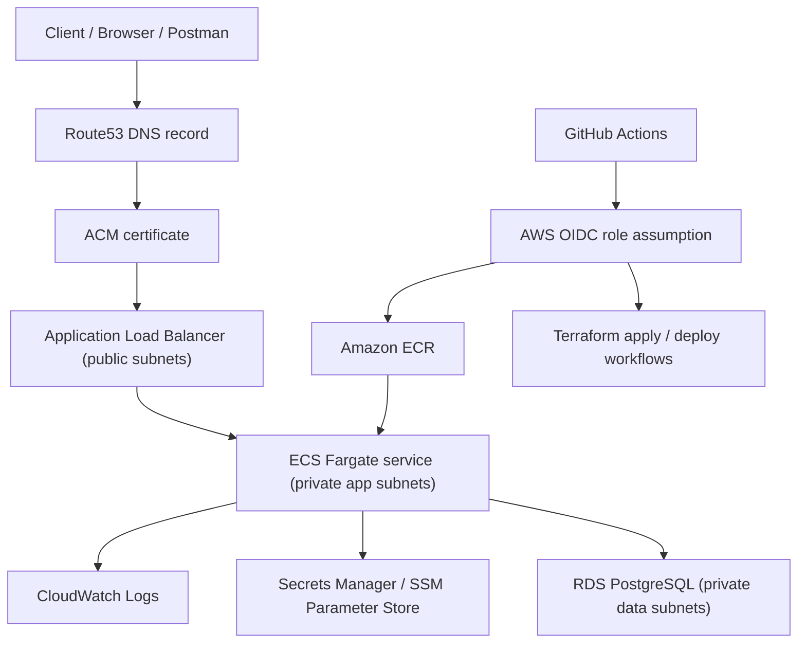

# TransitOps · AWS Target Architecture

## Purpose

Fix the target AWS topology for TransitOps before Terraform and deployment automation begin, so the cloud phase does not drift into ad hoc infrastructure decisions.

## Decision Status

- Reference date: April 6, 2026.
- Decision scope: target topology and operational boundaries for all upcoming cloud work.
- Decision intent: optimize for a small but credible production-style architecture, not for maximum feature breadth.

## Architecture Drivers

- Keep the application as a small stateless API that can run behind a standard AWS ingress path.
- Favor a deployment model that is easy to explain, defend, and automate through Terraform and GitHub Actions.
- Keep the runtime credible for AWS while still acknowledging dev-environment cost constraints.
- Avoid cloud-specific complexity that does not materially improve the quality of the project story.

## Target Topology

## Selected AWS Services

- Route53 for DNS.
- ACM for the public HTTPS certificate.
- Application Load Balancer as the only public ingress.
- ECS Fargate for the API runtime.
- Amazon ECR for application images.
- Amazon RDS for PostgreSQL.
- CloudWatch Logs, metrics, and alarms for the minimum observability baseline.
- Secrets Manager for sensitive runtime values.
- SSM Parameter Store for non-secret runtime configuration where that is more convenient than hardcoding Terraform literals.
- IAM roles for ECS task execution, ECS runtime access, and GitHub Actions OIDC-based automation.

## Network Layout

The target network is a single VPC per environment, spread across two availability zones.

- Two public subnets:
  - host the ALB;
  - host the NAT gateway for private-subnet egress in the dev environment.
- Two private app subnets:
  - host ECS Fargate tasks;
  - never receive direct public traffic.
- Two private data subnets:
  - host RDS PostgreSQL;
  - never expose the database publicly.

The intended traffic path is:

1. public HTTPS enters through Route53 and ACM-backed ALB;
2. ALB forwards only to the ECS target group;
3. ECS tasks connect privately to RDS;
4. RDS accepts traffic only from the ECS security group.

## Runtime Shape

TransitOps remains a single deployable backend service in AWS.

- One ECS cluster per environment.
- One ECS service for the API.
- One task definition family for the API container.
- One ECR repository for the API image.
- One RDS PostgreSQL instance per environment.

For the first deployable environment, the posture is intentionally pragmatic:

- ECS desired count: `1` in `dev`.
- RDS: `Single-AZ` in `dev`.
- NAT gateway: `1` in `dev` to control cost while keeping ECS tasks private.

This is not meant to be a high-availability production setup yet. It is meant to be a defensible, production-style architecture with explicit tradeoffs.

## Security Boundaries

- The ALB is the only public AWS resource in the application path.
- ECS tasks run in private subnets and do not receive public IPs.
- RDS is private-only and does not expose a public endpoint.
- Security groups are least-privilege by role:
  - ALB security group accepts `443` from the internet;
  - ECS security group accepts only ALB-to-container traffic;
  - RDS security group accepts only ECS-to-PostgreSQL traffic.
- No long-lived AWS access keys are planned for CI/CD; GitHub Actions must use OIDC role assumption.

## Configuration and Secrets Placement

- Application secrets go to Secrets Manager.
- Non-secret runtime configuration can be injected directly from Terraform or read from SSM Parameter Store.
- ECS task definitions expose runtime values to the container using .NET environment-variable naming conventions.
- The application remains stateless; no session or file storage is kept on local container disk.

## Observability Baseline

The minimum AWS observability surface is:

- one CloudWatch log group for the ECS service logs;
- ALB, ECS, and RDS metrics visible in CloudWatch;
- at least one dashboard covering API health, ECS health, ALB health, and database health;
- at least one alarm set for obvious service failure conditions.

## Deployment Path

The intended code-to-cloud path is:

1. GitHub Actions builds and tests the .NET solution;
2. GitHub Actions builds the container image;
3. GitHub Actions pushes the image to ECR;
4. Terraform provisions or updates the AWS infrastructure;
5. ECS rolls out the new task definition;
6. smoke tests validate the deployed environment.

## Explicit Non-Goals For This Architecture

These are intentionally excluded from the target architecture unless a later need justifies them:

- microservices;
- Kubernetes/EKS;
- multi-region failover;
- service mesh;
- public ECS tasks;
- public RDS access;
- separate queueing/event-driven subsystems;
- autoscaling policy tuning beyond a minimal first pass.

## Terraform Consequences

All Terraform work after this document should assume:

- one environment-specific VPC per deployed environment;
- ALB -> ECS Fargate -> RDS as the main application path;
- HTTPS termination at the ALB;
- private ECS and private RDS;
- OIDC-based GitHub Actions access;
- externalized secrets and configuration;
- no design work that assumes a different runtime platform unless this document is explicitly revised.
