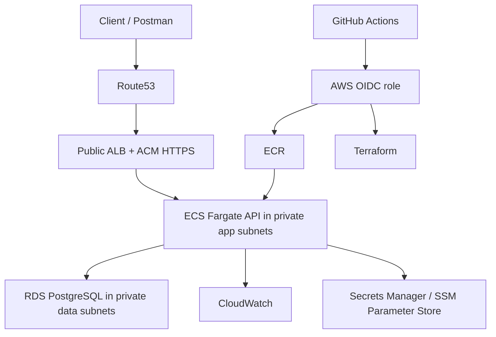

# TransitOps Cloud Architecture

## Purpose

This document is the single cloud reference for TransitOps. It defines the target AWS topology, shared conventions, and Terraform remote-state bootstrap path used by the cloud work.

## Target AWS Topology

TransitOps remains a single stateless backend API deployed behind a standard AWS ingress path.



Selected services:

- Route53 and ACM for DNS and HTTPS.
- ALB as the only public application ingress.
- ECS Fargate for the API runtime.
- ECR for container images.
- RDS PostgreSQL for persistence.
- CloudWatch for logs, metrics, dashboards, and alarms.
- Secrets Manager for secrets.
- SSM Parameter Store or Terraform environment variables for non-secret runtime configuration.
- GitHub Actions with AWS OIDC role assumption for CI/CD. Long-lived AWS access keys are not part of the intended steady-state path.

Explicit non-goals for this project stage:

- microservices;
- Kubernetes/EKS;
- multi-region failover;
- service mesh;
- public ECS tasks;
- public RDS access;
- separate queueing/event-driven subsystems.

## Network And Security Model

Each deployed environment gets one VPC across at least two availability zones.

Subnet layout:

- public subnets for ALB and NAT;
- private app subnets for ECS tasks;
- private data subnets for RDS.

Traffic model:

1. public application ingress enters through the ALB;
2. ALB forwards only to ECS targets;
3. ECS connects privately to RDS;
4. RDS accepts PostgreSQL traffic only from the ECS security group.

Security-group intent:

- ALB security group accepts public HTTP ingress in `dev` until a real domain/certificate exists, and public HTTPS ingress when ACM/Route53 are enabled.
- ECS security group accepts only ALB-to-container traffic.
- RDS security group accepts only ECS-to-PostgreSQL traffic.

Initial `dev` posture:

- ECS desired count: `1`;
- RDS: `Single-AZ`;
- NAT gateway: `1` to keep ECS private while controlling cost.
- planned hostname: `api.dev.transitops.net`.

The Terraform runtime module supports both HTTP-only development plans and the target HTTPS path. With the Route53 hosted zone for `transitops.net` available, the `dev` plan enables ACM certificate validation, Route53 records, HTTP-to-HTTPS redirect, and HTTPS listener `443` for `api.dev.transitops.net`.

## Naming, Tags, And Environments

Fixed constants:

- Project slug: `transitops`
- Service slug: `api`
- Default region: `eu-west-1`
- First deployed environment: `dev`
- Reserved future environment: `prod`

Default naming pattern:

```text
<project>-<environment>-<component>
```

Examples:

- `transitops-dev-vpc`
- `transitops-dev-alb`
- `transitops-dev-api-svc`
- `transitops-prod-db`

Common resource names:

| Resource | Convention |
| --- | --- |
| VPC | `<project>-<env>-vpc` |
| Public subnet | `<project>-<env>-public-<az>` |
| Private app subnet | `<project>-<env>-app-<az>` |
| Private data subnet | `<project>-<env>-data-<az>` |
| ALB SG | `<project>-<env>-alb-sg` |
| ECS SG | `<project>-<env>-ecs-sg` |
| RDS SG | `<project>-<env>-rds-sg` |
| ECS service | `<project>-<env>-api-svc` |
| RDS instance | `<project>-<env>-db` |
| ECR repository | `<project>/api` |
| CloudWatch log group | `/aws/ecs/<project>/<env>/api` |
| Terraform state bucket | `<project>-tfstate-<account-id>-<region>` |
| Terraform lock table | `<project>-tfstate-locks` |

Mandatory tags for taggable resources:

| Tag | Example |
| --- | --- |
| `Name` | `transitops-dev-alb` |
| `Project` | `TransitOps` |
| `Environment` | `dev` |
| `ManagedBy` | `Terraform` |
| `Owner` | `pey` |
| `Repository` | `pey-45/TransitOps` |
| `Service` | `api` or `platform` |

Environment rules:

- `dev` and `prod` must have separate Terraform state keys, VPCs, ECS services, RDS instances, secret namespaces, DNS records, and CloudWatch namespaces.
- `api.dev.<root-domain>` is the intended dev hostname.
- `api.<root-domain>` is the intended prod hostname.
- AWS deployments should run the app with `ASPNETCORE_ENVIRONMENT=Production`; environment identity comes from AWS names, tags, DNS, and runtime configuration.

## Runtime Configuration And Secrets

Runtime settings must be externalized. Secrets must not be committed.

Preferred placement:

| Setting Type | Store |
| --- | --- |
| Database connection string | Secrets Manager |
| JWT signing key | Secrets Manager |
| Bootstrap admin token | Secrets Manager |
| JWT issuer/audience/expiration | SSM Parameter Store or Terraform environment variables |
| Non-secret operational settings | SSM Parameter Store or Terraform environment variables |

.NET configuration keys should keep the existing double-underscore shape:

- `ConnectionStrings__DefaultConnection`
- `Jwt__Issuer`
- `Jwt__Audience`
- `Jwt__SigningKey`
- `Jwt__ExpirationMinutes`
- `Bootstrap__FirstAdminToken`

AWS migrations should not depend on API startup side effects. The later deployment path should run EF Core migrations explicitly as a deployment step or dedicated task.

## Terraform Runtime Layer

Sprint 3 encodes the AWS runtime path as Terraform, but it does not apply it yet.

Reusable modules:

- `container_registry`: creates the ECR repository for the API image, enables image scanning on push, and applies a basic image retention policy.
- `observability`: creates the CloudWatch log group consumed by ECS container logs.
- `database`: creates the private RDS PostgreSQL baseline, DB subnet group, and DB parameter group using the data subnets and RDS security group from the foundation module.
- `runtime_config`: defines the Secrets Manager and SSM Parameter Store contract for runtime configuration without committing secret values.
- `container_runtime`: creates ECS cluster, task execution role, task role, task definition, ECS service, ALB, target group, HTTP listener, health check, and optional future HTTPS/ACM/Route53 wiring.

The `dev` environment wires these modules to the Sprint 2 foundation outputs:

- ALB uses `public_subnet_ids`.
- ECS service uses `app_subnet_ids`.
- RDS uses `data_subnet_ids`.
- Security groups come from the foundation module: ALB -> ECS -> RDS.
- Common tags and service tags come from the same Terraform convention outputs.

The API container contract is:

- container port: `8080`;
- readiness path: `/api/v1/health/ready`;
- launch type: ECS Fargate with `awsvpc` networking;
- logs: CloudWatch through the `awslogs` driver;
- .NET configuration keys keep the existing `__` environment-variable shape;
- secrets are referenced by ARN from Secrets Manager, never embedded in Terraform values.

## Terraform Remote State

Terraform environment roots use an S3 backend with DynamoDB locking.

Why:

- S3 stores the shared Terraform state file.
- S3 versioning allows recovery from previous state versions.
- S3 server-side encryption protects state at rest.
- DynamoDB locking prevents concurrent Terraform runs from modifying the same state at the same time.

Bootstrap resources:

- one S3 bucket named `transitops-tfstate-<account-id>-<region>`;
- server-side encryption enabled;
- versioning enabled;
- public access blocked;
- one DynamoDB table named `transitops-tfstate-locks`;
- one state key per environment root:
  - `dev/foundation.tfstate`
  - `prod/foundation.tfstate`

Bootstrap flow:

```powershell
cd infra\terraform\bootstrap\remote_state
Copy-Item terraform.tfvars.example terraform.tfvars
terraform init
terraform fmt -recursive
terraform validate
terraform plan
terraform apply
```

After apply:

1. read `terraform_state_bucket_name`, `terraform_lock_table_name`, `dev_backend_config`, and `prod_backend_config`;
2. copy each environment `backend.hcl.example` to `backend.hcl`;
3. replace placeholders with the bootstrap outputs;
4. initialize each environment root:

```powershell
cd infra\terraform\environments\dev
terraform init -backend-config=backend.hcl
```

The bootstrap root intentionally uses local state only to create the backend resources. Application infrastructure must live in the environment roots, not in the bootstrap root.
