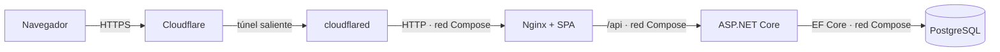

# Despliegue ligero de TransitOps

## Alcance

Este procedimiento despliega TransitOps en una VM Ubuntu Server 24.04 LTS mediante Docker Compose. La aplicación solo es accesible por la URL HTTPS temporal que crea `cloudflared`; ningún contenedor publica puertos en la VM y no es necesario abrir ni redirigir puertos del router.

El túnel rápido de Cloudflare se utiliza para la demostración y el vídeo del TFG, no como alojamiento permanente. Su hostname `*.trycloudflare.com` cambia si se recrea el contenedor `cloudflared`.



La terminación TLS ocurre en Cloudflare. La API se ejecuta con `ASPNETCORE_ENVIRONMENT=Production`, por lo que la cookie de sesión conserva `Secure` aunque el tramo privado entre `cloudflared` y Nginx sea HTTP. El acceso HTTP directo no está soportado ni expuesto.

## 1. Publicar las imágenes

Cada `push` a `main` o a una etiqueta ejecuta las pruebas de CI antes de publicar dos imágenes:

- `ghcr.io/pey-45/transitops-api:<sha>` y `:latest`;
- `ghcr.io/pey-45/transitops-web:<sha>` y `:latest`.

El job usa el `GITHUB_TOKEN` efímero de Actions; el repositorio no necesita secretos de registro. Tras la primera publicación, comprueba en GitHub que ambos paquetes tienen visibilidad **Public**. Esta es la única configuración manual del registro y permite que la VM ejecute `docker compose pull` sin `docker login`.

No continúes hasta que el workflow del commit que se va a demostrar esté verde y sus dos imágenes aparezcan en Packages.

## 2. Preparar la VM

La VM solo necesita salida a Internet. No requiere modo puente ni reglas de entrada para la aplicación; la consola de Hyper-V o SSH se usan para administrarla.

Instala Docker Engine, el plugin Compose v2, Git y `curl`:

```bash
sudo apt-get update
sudo apt-get install -y ca-certificates curl docker.io docker-compose-v2 git
sudo systemctl enable --now docker
sudo docker compose version
```

Opcionalmente, si la VM ofrece SSH, limita ese servicio a la red administrativa con el cortafuegos del sistema. TransitOps no necesita reglas de entrada propias.

Clona el repositorio público en la ruta usada por las unidades systemd:

```bash
sudo git clone https://github.com/pey-45/TransitOps.git /opt/transitops
sudo chown -R "$(id -un):$(id -gn)" /opt/transitops
cd /opt/transitops
git switch main
git pull --ff-only
```

## 3. Crear la configuración privada

Copia la plantilla y sustituye todos los valores `change-me`. Las tres credenciales deben ser largas, aleatorias y distintas de las de desarrollo:

```bash
cd /opt/transitops
umask 077
cp .env.deploy.example .env
nano .env
```

Puedes generar valores con `openssl rand -base64 48`. Conserva `IMAGE_TAG=latest` para que el timer recoja la última publicación validada. Para una demostración o una reversión completamente fijada, usa el SHA de 40 caracteres publicado por CI.

Protege el fichero después de editarlo:

```bash
sudo chown root:root /opt/transitops/.env
sudo chmod 600 /opt/transitops/.env
```

La configuración real no se copia al repositorio. Compose falla antes de arrancar si falta alguna variable obligatoria.

## 4. Desplegar y verificar

El mismo script se usa manualmente y desde systemd:

```bash
cd /opt/transitops
sudo ./scripts/deploy.sh
```

El script valida la configuración, descarga las imágenes, aplica el Compose, espera a sus healthchecks, consulta `/api/v1/health` desde el contenedor `web` y muestra el SHA y el digest de las imágenes en ejecución. Al final imprime también la URL pública del túnel.

### Consultar la URL pública

`cloudflared` genera un hostname nuevo cada vez que se crea el contenedor y no lo escribe en ningún fichero: solo aparece en su log. Para leerla en cualquier momento, sin volver a desplegar:

```bash
cd /opt/transitops && sudo docker compose --env-file .env --file docker-compose.deploy.yml logs cloudflared | grep -oE 'https://[a-z0-9-]+\.trycloudflare\.com' | tail -1
```

Si no devuelve nada, el túnel todavía se está registrando: espera unos segundos y repite. Para ver el log completo y diagnosticar un fallo de conexión:

```bash
sudo docker compose --env-file .env --file docker-compose.deploy.yml logs cloudflared
```

**La URL cambia si el contenedor `cloudflared` se recrea, y eso puede ocurrir sin pedirlo.** `deploy.sh` hace `pull` de los cuatro servicios, así que si Cloudflare publica una imagen `cloudflared:latest` nueva, el timer la descarga y recrea el contenedor en su siguiente ejecución, con hostname distinto. Antes de grabar, detén el timer para que la URL no se mueva a mitad de la demostración:

```bash
sudo systemctl stop transitops-deploy.timer
```

Reactívalo con `sudo systemctl start transitops-deploy.timer` cuando ya no dependas de una URL estable.

Para diagnosticar el stack sin exponer un puerto HTTP:

```bash
sudo docker compose --env-file .env --file docker-compose.deploy.yml ps
sudo docker compose --env-file .env --file docker-compose.deploy.yml exec -T web \
  wget --quiet --output-document=- http://127.0.0.1/api/v1/health
```

Abre la URL `https://….trycloudflare.com` desde otro equipo y verifica que `/api/v1/health` devuelve `{"status":"healthy"}`. Una conexión a `http://<IP-de-la-VM>` debe fallar porque no existe ningún puerto publicado.

## 5. Crear el primer administrador

El bootstrap se ejecuta una sola vez por la URL HTTPS. No uses una dirección HTTP ni escribas el token en una captura pública:

```bash
read -r -p "URL HTTPS del túnel: " TRANSITOPS_URL
read -r -s -p "Token de bootstrap: " TRANSITOPS_BOOTSTRAP_TOKEN
echo

curl --fail-with-body --request POST "${TRANSITOPS_URL}/api/v1/auth/bootstrap-admin" \
  --header "Content-Type: application/json" \
  --header "X-Bootstrap-Token: ${TRANSITOPS_BOOTSTRAP_TOKEN}" \
  --data '{"username":"admin","email":"admin@example.invalid","password":"ChangeThisAdminPassword!2026"}'
```

Cambia los datos de ejemplo y guarda la contraseña fuera del repositorio. Un segundo bootstrap debe responder con `409 first_admin_already_exists`.

En las herramientas del navegador, comprueba que `transitops_session` lleva `HttpOnly`, `Secure` y `SameSite=Strict`, que recargar conserva la sesión y que `document.cookie` no permite leerla.

## 6. Activar la actualización periódica

Instala la unidad y el timer incluidos en el repositorio:

```bash
sudo install -m 0644 deploy/systemd/transitops-deploy.service /etc/systemd/system/
sudo install -m 0644 deploy/systemd/transitops-deploy.timer /etc/systemd/system/
sudo systemctl daemon-reload
sudo systemctl enable --now transitops-deploy.timer
sudo systemctl list-timers transitops-deploy.timer
```

El timer invoca `scripts/deploy.sh` al arrancar y cada cinco minutos. Con `IMAGE_TAG=latest`, un despliegue solo puede avanzar a una imagen que el workflow publicó después de superar backend, frontend y E2E. La VM nunca recibe conexiones desde Actions: consulta GHCR mediante `pull`.

Consulta la ejecución automática y sus digests con:

```bash
sudo systemctl start transitops-deploy.service
sudo journalctl -u transitops-deploy.service --since today --no-pager
```

Los cambios futuros del propio Compose, del script o de las unidades requieren actualizar `/opt/transitops` con `git pull --ff-only`; el timer actualiza las imágenes de aplicación, no los ficheros del repositorio.

## 7. Reversión y parada

Para volver a una imagen anterior, cambia `IMAGE_TAG` en `.env` por un SHA publicado y ejecuta de nuevo `scripts/deploy.sh`. La base de datos permanece en el volumen `transitops-data`; las migraciones de este proyecto son acumulativas y la reversión de imagen no revierte automáticamente el esquema.

Para detener la demostración sin borrar datos:

```bash
sudo systemctl stop transitops-deploy.timer
sudo docker compose --env-file .env --file docker-compose.deploy.yml down
```

No añadas `--volumes` salvo que quieras eliminar de forma irreversible la base de datos de la demostración.

## 8. Guion de evidencia

Graba en una sola pieza, en este orden:

1. `git rev-parse HEAD` y el workflow verde correspondiente.
2. `sudo ./scripts/deploy.sh`, incluidos SHA, digests, health check y la URL del túnel.
3. `systemctl list-timers` y `journalctl -u transitops-deploy.service`, para evidenciar la vía automática.
4. `sudo systemctl stop transitops-deploy.timer`, para fijar la URL durante el resto de la grabación.
5. Los cuatro flujos de negocio por la URL HTTPS del túnel.
6. La cookie con `HttpOnly`, `Secure` y `SameSite=Strict` en las herramientas del navegador, y la ausencia de puertos publicados en `docker compose ps`.

El paso 4 va deliberadamente después del 3: el timer hay que demostrarlo antes de detenerlo, y detenerlo evita que una imagen `cloudflared` nueva cambie el hostname a mitad de los flujos.

Conserva el vídeo y anota el SHA mostrado: la URL temporal no constituye evidencia duradera por sí sola.
