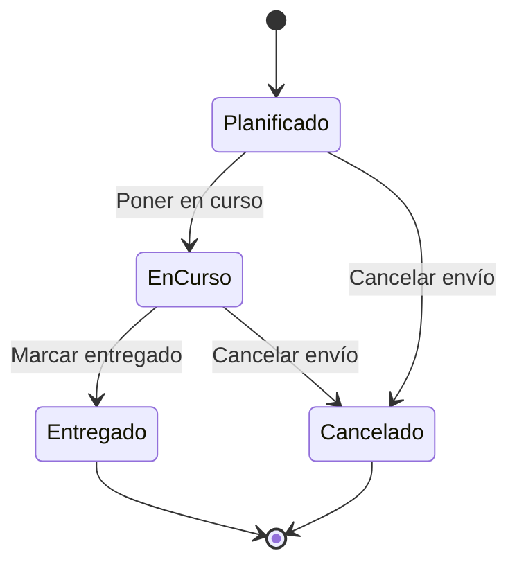

# Manual de usuario de TransitOps

## Qué es TransitOps

TransitOps es una aplicación web para la gestión operativa de una flota de transporte. Permite mantener los catálogos de vehículos, conductores y clientes, planificar envíos, asignarles recursos, seguir su ciclo de vida hasta la entrega y conservar un historial de lo que ocurrió en cada uno.

Se usa desde el navegador. No necesita instalación en el equipo del usuario ni configuración previa: basta con la dirección de la aplicación y unas credenciales.

Este manual describe la aplicación desde el punto de vista de quien la utiliza. La instalación y el despliegue se documentan aparte, en [Deployment.md](Deployment.md).

## Roles y permisos

Cada persona usuaria tiene exactamente uno de estos dos roles:

| Función | Operador | Administrador |
| --- | --- | --- |
| Consultar el resumen operativo | Sí | Sí |
| Envíos: alta, edición, asignación, estados y eventos | Sí | Sí |
| Vehículos, conductores y clientes: alta, edición y baja | Sí | Sí |
| Cambiar su propia contraseña | Sí | Sí |
| Ver y crear personas usuarias | No | Sí |
| Cambiar el rol de otra persona | No | Sí |
| Desactivar y reactivar personas usuarias | No | Sí |
| Asignar una contraseña nueva a otra persona | No | Sí |

La diferencia entre ambos roles es, por tanto, únicamente la administración de usuarios. En el trabajo diario con envíos y catálogos los dos roles pueden hacer lo mismo.

El menú superior refleja el rol: el enlace **Usuarios** solo aparece para administradores. Si un operador escribe directamente la dirección `/usuarios`, la aplicación lo devuelve a la pantalla de inicio en lugar de mostrarle la página.

## Acceso a la aplicación

### Primer acceso del sistema

Una instalación recién desplegada no tiene ninguna persona usuaria. El primer administrador se crea una sola vez mediante el procedimiento de arranque descrito en el apartado 5 de [Deployment.md](Deployment.md), que requiere un token de configuración. A partir de ahí, ese administrador crea al resto del equipo desde la propia aplicación.

Un segundo intento de arranque se rechaza: solo puede haber un primer administrador.

### Iniciar y cerrar sesión

En la pantalla de acceso se introducen usuario y contraseña. Si las credenciales no son correctas, o si la cuenta está desactivada, la aplicación muestra el mismo mensaje —«El usuario o la contraseña no son válidos.»— sin distinguir entre ambos casos.

La sesión se mantiene aunque se recargue la página o se cierre la pestaña, y caduca por sí sola al cabo de una hora. Para terminarla antes, se usa **Cerrar sesión** en la esquina superior derecha.

La sesión viaja en una cookie que el navegador gestiona por su cuenta; no hay ningún dato de acceso guardado en el equipo que otra página pueda leer.

### Cambiar la contraseña

Desde **Cambiar contraseña**, en la cabecera. Pide la contraseña actual y la nueva por duplicado. La nueva debe tener al menos 10 caracteres.

Conviene saber que **el cambio invalida inmediatamente la sesión en curso**, incluida la del propio navegador desde el que se hace. La aplicación confirma el cambio con un mensaje de éxito, pero la sesión ya no sirve: la siguiente acción que intente fallará y, al recargar la página, se volverá a la pantalla de acceso. Lo correcto tras cambiar la contraseña es cerrar sesión y volver a entrar con la nueva.

Esto es deliberado: si alguien cambia su contraseña porque sospecha que alguien más la conocía, cualquier sesión abierta con la anterior deja de funcionar en el acto.

**No existe recuperación automática de contraseña olvidada** (no hay ningún envío de correo). Cuando alguien la pierde, un administrador le asigna una nueva desde la administración de usuarios, como se describe más abajo.

## Pantalla de inicio: el resumen operativo

Es la primera pantalla tras acceder y ofrece dos bloques con naturaleza distinta.

**Envíos por estado.** Cuatro contadores —planificados, en curso, entregados y cancelados— más el total. Reflejan la situación actual completa y **no dependen del periodo** seleccionado más abajo. Cada contador es un enlace: al pulsarlo se abre el listado de envíos ya filtrado por ese estado.

**Actividad en el periodo.** Aquí sí interviene el rango de fechas, que por defecto cubre los últimos 30 días y puede cambiarse con los campos *Desde* y *Hasta*. Muestra el número de incidencias registradas y dos tablas con el reparto de envíos por vehículo y por conductor.

Un matiz sobre qué fecha se usa en cada caso: la actividad por vehículo y conductor se cuenta por la **fecha prevista de recogida** del envío, mientras que las incidencias se cuentan por la **fecha en que ocurrió** el suceso. Los dos extremos del rango se incluyen.

## Catálogos: vehículos, conductores y clientes

Los tres funcionan igual. Cada uno tiene su listado, su formulario de alta y edición, y su ficha de detalle.

### Comportamiento común

Las bajas son **lógicas**: nada se borra. Un elemento dado de baja desaparece de los listados y de los desplegables de asignación, pero se conserva íntegro en los envíos históricos donde participó, que lo siguen mostrando con la marca *(dado de baja)*.

Esto tiene una consecuencia práctica útil: las reglas de unicidad solo se aplican entre elementos activos. Si un vehículo se da de baja, su matrícula queda libre para volver a usarse en un alta nueva.

Conviene tener presente que **dar de baja un recurso no comprueba si está asignado a envíos abiertos**. La baja se aplica igualmente y el envío conserva la asignación; el desplegable mostrará ese recurso marcado como dado de baja. Si la intención era liberarlo, hay que retirar la asignación en el envío además de dar de baja el recurso.

### Vehículos

| Campo | Obligatorio | Notas |
| --- | --- | --- |
| Matrícula | Sí | Máximo 20 caracteres. Única entre los vehículos activos. |
| Código interno | No | Máximo 50 caracteres. Único entre los vehículos activos si se rellena. |
| Marca | No | Máximo 80 caracteres. |
| Modelo | No | Máximo 80 caracteres. |
| Capacidad de carga | No | En kilogramos. Se usa para avisar de sobrecarga al asignar. |

### Conductores

| Campo | Obligatorio | Notas |
| --- | --- | --- |
| Nombre | Sí | Máximo 160 caracteres. |
| Número de carné | Sí | Máximo 50 caracteres. Único entre los conductores activos. |
| Código de empleado | No | Máximo 50 caracteres. |
| Datos de contacto | No | Máximo 500 caracteres. |

### Clientes

| Campo | Obligatorio | Notas |
| --- | --- | --- |
| Nombre | Sí | Máximo 160 caracteres. No exige ser único. |
| Datos de contacto | No | Máximo 500 caracteres. |

## Envíos

Es el núcleo de la aplicación y la pantalla donde se concentra el trabajo diario.

### Listado y filtros

El listado muestra referencia, estado, ruta, fechas previstas de recogida y entrega, cliente, vehículo y conductor. La referencia es un enlace a la ficha del envío.

Se puede filtrar por estado, por rango de fechas de recogida, por vehículo y por conductor. Los filtros se combinan entre sí y quedan reflejados en la dirección del navegador, así que una búsqueda concreta se puede guardar en marcadores o pasar a otra persona por su URL. El botón **Limpiar** los descarta todos.

Los resultados se paginan; el pie indica la página actual, el total de páginas y el número de envíos que cumplen el filtro.

### Alta y edición

| Campo | Obligatorio | Notas |
| --- | --- | --- |
| Referencia | Sí | Máximo 50 caracteres. Única en todo el sistema, incluidos los envíos cerrados. |
| Origen y destino | Sí | Máximo 160 caracteres cada uno. |
| Recogida prevista | Sí | Fecha y hora. |
| Entrega prevista | No | Fecha y hora. No puede ser anterior a la recogida. |
| Cliente | No | Solo se ofrecen clientes activos. |
| Carga estimada | No | En kilogramos. |
| Notas | No | Máximo 500 caracteres. |

A diferencia de los catálogos, la referencia es única de forma global y para siempre: no se libera aunque el envío se entregue o se cancele.

Al editar un envío cuyo cliente se dio de baja mientras tanto, el desplegable conserva ese cliente marcado como dado de baja, de modo que guardar el resto de cambios no obliga a perder el vínculo.

### Ficha del envío

Reúne todos los datos del envío junto con tres paneles de trabajo: asignación de recursos, ciclo de vida e historial de eventos.

Además de las fechas previstas, la ficha muestra la **recogida real** y la **entrega real**. No se introducen a mano: la aplicación las sella automáticamente cuando el envío pasa a en curso y cuando se marca como entregado.

### Asignar vehículo y conductor

La asignación es **conjunta**: se eligen vehículo y conductor a la vez y el botón permanece deshabilitado hasta que ambos están seleccionados. Solo se puede asignar **mientras el envío está planificado**; una vez en curso, el panel desaparece.

Los desplegables ofrecen únicamente recursos activos. **Quitar asignación** deja el envío sin vehículo ni conductor, y puede repetirse sin efecto si ya estaba libre.

Dos reglas gobiernan lo que la aplicación acepta:

- **Sin doble reserva.** Un vehículo o un conductor no pueden estar asignados a dos envíos abiertos —planificados o en curso— al mismo tiempo. Si se intenta, el mensaje de error identifica el envío que ya lo ocupa, de modo que se puede ir a él directamente. Los envíos entregados o cancelados no bloquean nada.
- **La capacidad avisa, no impide.** Si la carga estimada del envío supera la capacidad del vehículo, la asignación se realiza igualmente y la aplicación muestra un aviso con ambas cifras. Es información para quien decide, no una prohibición.

### Ciclo de vida

Un envío recorre estos estados:

- **Poner en curso** exige vehículo y conductor asignados. Si faltan, el botón está deshabilitado y un aviso lo explica.
- **Marcar entregado** y **Cancelar envío** piden confirmación, porque llevan a un estado final.
- **Entregado y cancelado son irreversibles.** No hay forma de reabrir un envío cerrado; la ficha lo indica expresamente y retira los botones de acción.

### Historial de eventos

Cada envío conserva una línea de tiempo de lo que le fue ocurriendo. El historial es **inmutable**: los eventos se añaden, nunca se editan ni se borran.

Hay dos clases de evento. Los **automáticos** los genera la aplicación al operar: creación, asignación, asignación retirada, salida, entrega y cancelación. Los **manuales** los registra la persona usuaria con el botón *Registrar evento*, y son de dos tipos:

- **Punto de control**, para dejar constancia del avance.
- **Incidencia**, para lo que se desvía de lo previsto. Son las que cuenta el resumen operativo.

Al registrar un evento manual se indica su fecha y hora —que por defecto es el momento actual y puede retrasarse para anotar algo ocurrido antes, pero no adelantarse al futuro—, y opcionalmente una ubicación y unas notas.

Cada entrada de la línea de tiempo muestra su tipo, la fecha del suceso, quién lo registró y si fue manual o automático. El orden es cronológico por fecha del suceso, no por orden de introducción: un evento anotado a posteriori aparece en su sitio real.

## Administración de personas usuarias

Solo visible para administradores, en el enlace **Usuarios**.

El listado muestra usuario, correo, rol y estado. Por defecto solo aparecen las cuentas activas; la casilla **Mostrar también los desactivados** revela el resto, necesarias para poder reactivarlas.

**Crear una cuenta** pide usuario (mínimo 3 caracteres), correo, una contraseña inicial de al menos 10 caracteres y el rol. El usuario y el correo deben ser únicos en todo el sistema, incluidas las cuentas desactivadas.

**Cambiar el rol** se hace en el propio desplegable de la fila, con confirmación. **Desactivar** y **Reactivar** también actúan sobre la fila y piden confirmación.
**Asignar una contraseña nueva.** El botón **Restablecer contraseña** de cada fila abre un panel donde se escribe la contraseña nueva por duplicado, con el mismo mínimo de 10 caracteres, y se confirma con **Guardar contraseña**. No hace falta conocer la anterior: es la vía para atender a quien ha olvidado la suya. Al guardarla, se cierran todas las sesiones abiertas de esa persona, que deberá entrar con la contraseña nueva. Comunícasela por un canal aparte y recuérdale que la cambie desde su cuenta.

Funciona también sobre cuentas desactivadas, lo que permite dejar la contraseña preparada antes de reactivarlas. Y no se puede usar sobre la propia cuenta: en tu fila el botón se sustituye por un enlace a **Cambiar mi contraseña**, porque cambiar la propia siempre exige confirmar la actual.

Una cuenta desactivada no puede iniciar sesión, pero su rastro se conserva: los eventos que registró siguen mostrando su nombre en los historiales.

Hay una protección que no se puede saltar: **el sistema nunca se queda sin administradores activos**. Si se intenta desactivar al último administrador, o degradarlo a operador, la operación se rechaza con un mensaje explicativo. La aplicación garantiza esta regla incluso si dos administradores intentan la operación simultáneamente.

## Mensajes frecuentes y qué hacer

| Mensaje | Qué significa | Qué hacer |
| --- | --- | --- |
| El usuario o la contraseña no son válidos. | Credenciales incorrectas o cuenta desactivada. | Revisar los datos; si son correctos, pedir a un administrador que confirme el estado de la cuenta. |
| Ya existe un envío con esa referencia. | La referencia está en uso, quizá por un envío ya cerrado. | Usar otra referencia. |
| Ya existe un vehículo activo con esa matrícula / un conductor activo con ese número de carné. | Choca con un elemento **activo**. | Comprobar si el elemento ya existe antes de darlo de alta de nuevo. |
| El nombre de usuario o correo ya está en uso. | Choca con otra cuenta, activa o desactivada. | Elegir otro usuario o correo, o reactivar la cuenta existente. |
| El vehículo/conductor ya está asignado al envío *X*. | Doble reserva en envíos abiertos. | Ir al envío *X* y liberar el recurso, o elegir otro. |
| La capacidad del vehículo (…) es inferior a la carga estimada (…). | Aviso, no error: la asignación se guardó. | Decidir si se acepta o se elige un vehículo mayor. |
| Solo se puede asignar mientras el envío está planificado. | El envío ya salió. | Si hay que corregir los recursos, cancelar el envío y crear uno nuevo. |
| Para poner el envío en curso hay que asignar vehículo y conductor. | Falta la asignación. | Asignar ambos y reintentar. |
| Un envío entregado o cancelado no puede cambiar de estado. | Estado final. | No hay vuelta atrás; crear un envío nuevo si procede. |
| No se puede dejar la aplicación sin ningún administrador activo. | Es el último administrador. | Nombrar antes a otro administrador. |
| Cambia tu propia contraseña desde tu cuenta, confirmando la actual. | Has intentado restablecer tu propia contraseña desde la administración. | Usar **Cambiar contraseña** en la cabecera. |
| El cliente/vehículo/conductor indicado no existe o está dado de baja. | Se dio de baja mientras se editaba. | Recargar la pantalla y elegir otro. |

## Límites conocidos de esta versión

Conviene tenerlos presentes para no buscar funciones que no existen:

- **No hay borrado real.** Ni de envíos, ni de catálogos, ni de cuentas: todo es baja lógica o historial permanente.
- **No hay recuperación automática de contraseña.** No se envían correos: quien la olvide depende de que un administrador le asigne una nueva.
- **Cambiar la contraseña obliga a volver a entrar**, y la aplicación no lo hace automáticamente.
- **La baja de un recurso no verifica sus asignaciones abiertas.**
- **Un envío en curso no admite cambios de recursos.** La asignación se cierra al salir.
- **No hay exportación de datos** a hoja de cálculo ni informes imprimibles.
