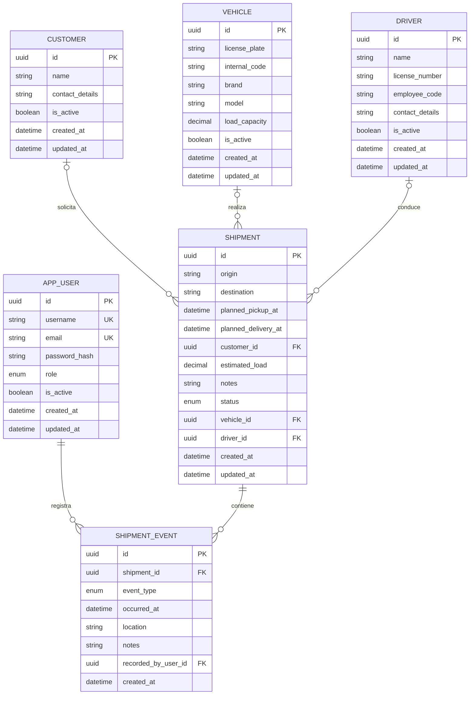

# Modelo de datos de TransitOps

## Alcance

Este diseño cubre el dominio completo definido en `docs/Requirements.md`. En el Sprint 1 solo se implementa y migra `AppUser`; las demás entidades se incorporarán mediante migraciones incrementales en los sprints correspondientes.

## Entidades y decisiones

- `AppUser`: usuario interno con rol `Admin` u `Operator`. La contraseña solo se guarda como hash. `IsActive` aplica la baja lógica exigida por RNF-03.
- `Vehicle`, `Driver` y `Customer`: catálogos con baja lógica. Las unicidades funcionales solo afectan a registros activos y se reforzarán en servicio y base de datos al implementar cada catálogo.
- `Shipment`: agregado operativo con estado `Planned`, `InProgress`, `Delivered` o `Cancelled`. Cliente, carga estimada, vehículo, conductor y entrega prevista son opcionales. Conserva las relaciones históricas aunque el catálogo relacionado se desactive.
- `ShipmentEvent`: historial inmutable del envío, ordenado por `OccurredAt`, siempre vinculado al usuario que lo registró. Tipos previstos: creación, asignación, salida, punto de control, incidencia, entrega y cancelación.

## Restricciones principales

- La entrega prevista no puede preceder a la recogida (RN-06).
- Solo recursos activos pueden participar en nuevas asignaciones (RN-03), sin doble reserva en envíos no terminados (RN-04).
- La capacidad insuficiente genera aviso, no bloqueo (RN-05).
- El envío solo pasa a curso con vehículo y conductor, y un estado terminal no se revierte (RN-07/RN-08).
- Las bajas son lógicas: no se aplican borrados en cascada sobre el historial (RN-15/RNF-03).
