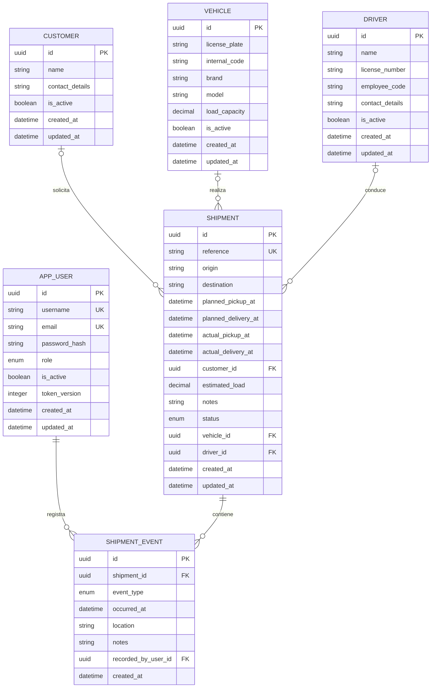

# Modelo de datos de TransitOps

## Alcance

Este diseño cubre el dominio completo definido en `docs/Requirements.md`. El Sprint 1 implementó y migró `AppUser`; el Sprint 2 incorporó `Vehicle`, `Driver` y `Customer`; el Sprint 3 incorporó `Shipment`; el Sprint 4 completó su operación con asignación, estados y fechas reales, y el Sprint 5 incorporó `ShipmentEvent`. El Sprint 6 reutilizó el esquema completo para administración e indicadores, sin generar una migración nueva.

## Entidades y decisiones

- `AppUser`: usuario interno con rol `Admin` u `Operator`. La contraseña solo se guarda como hash. `IsActive` aplica la baja lógica exigida por RNF-03. Usuario y correo tienen unicidad global, también para registros inactivos: no se reutilizan porque forman parte de la identidad conservada en el historial. `TokenVersion` se incluye en cada JWT y aumenta tras cambiar contraseña, desactivar la cuenta o cambiar el rol, por lo que cualquier sesión emitida antes deja de ser válida.
- `Vehicle`, `Driver` y `Customer`: catálogos con baja lógica. Las unicidades funcionales solo afectan a registros activos y se reforzarán en servicio y base de datos al implementar cada catálogo.
- `Shipment`: agregado operativo con referencia única global y estado `Planned`, `InProgress`, `Delivered` o `Cancelled`. No usa `IsActive`: su ciclo se expresa mediante el estado. Cliente, carga estimada, vehículo, conductor y entrega prevista son opcionales; sus claves foráneas usan `RESTRICT` para conservar relaciones históricas aunque el catálogo se desactive. Las fechas de negocio se normalizan y persisten en UTC; la recogida y entrega reales se sellan automáticamente al entrar en `InProgress` y `Delivered`.
- `ShipmentEvent`: historial inmutable del envío: solo admite alta y consulta. `OccurredAt` expresa cuándo sucedió el hecho y puede indicarlo el operador; `CreatedAt` conserva cuándo se anotó. Los tipos `Created`, `Assigned`, `Unassigned`, `Departed`, `Delivered` y `Cancelled` están reservados al sistema, mientras que `Checkpoint` e `Incident` se registran manualmente. `RecordedByUserId` identifica al actor autenticado y solo puede ser nulo en trazas de sistema sin identidad. La relación con `Shipment` usa `CASCADE` como única excepción al criterio restrictivo general porque el evento forma parte del agregado y no tiene vida independiente; la relación con `AppUser` conserva `RESTRICT`.

## Restricciones principales

- La entrega prevista no puede preceder a la recogida (RN-06).
- Solo recursos activos pueden participar en nuevas asignaciones (RN-03), sin doble reserva en envíos no terminados (RN-04).
- RN-04 se comprueba primero en el servicio mediante una consulta sobre otros envíos `Planned` o `InProgress`, excluyendo el envío actual, para devolver un conflicto descriptivo. PostgreSQL garantiza además la regla bajo concurrencia mediante dos índices únicos parciales: uno para `VehicleId` y otro para `DriverId`, ambos limitados a estados abiertos y valores no nulos. Si dos asignaciones superan simultáneamente la comprobación previa, la violación `23505` se traduce al mismo contrato 409. Estos índices parciales sustituyen a los índices simples `IX_shipments_VehicleId` e `IX_shipments_DriverId`, porque EF Core define un único índice por columna: la migración `HardenConcurrencyRules` los elimina. En consecuencia, las consultas que filtran por vehículo o conductor sin restringir el estado —el filtro del listado y la actividad por recurso del resumen— dejan de estar cubiertas para los envíos ya cerrados. El efecto es irrelevante en los volúmenes previstos por RNF-06 y se prefiere la garantía de unicidad; si el histórico creciese, bastaría con declarar un segundo índice no único sobre las mismas columnas con un nombre propio.
- RN-12 se protege en el servicio y, para PostgreSQL, serializa las operaciones que podrían eliminar el último administrador activo con un `pg_advisory_xact_lock` mantenido dentro de la transacción. Así, dos bajas o cambios de rol concurrentes vuelven a evaluar la regla en orden y no pueden dejar la aplicación sin administradores.
- La capacidad insuficiente genera aviso, no bloqueo (RN-05).
- El envío solo pasa a curso con vehículo y conductor, y un estado terminal no se revierte (RN-07/RN-08).
- Las bajas de catálogos y usuarios son lógicas y no eliminan historial (RN-15/RNF-03). El único borrado en cascada modelado es `Shipment` → `ShipmentEvent`; la API no permite borrar envíos y, si esa política cambiase, no quedarían eventos huérfanos.
