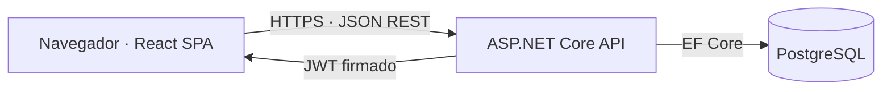

# Arquitectura de integración

## Visión general

La SPA no accede a la base de datos. Consume `/api/v1/*` y la API concentra autenticación, autorización, validación y reglas de negocio. Nginx sirve los recursos estáticos y reenvía `/api` al backend en Docker; Vite realiza el mismo proxy durante desarrollo.

## Sesión y roles

`POST /api/v1/auth/login` devuelve un JWT y el usuario efectivo. El token contiene `sub`, `unique_name`, `email` y `role`; la API valida firma, emisor, audiencia y caducidad en cada ruta protegida. La SPA guarda temporalmente la sesión en `localStorage`, añade el token en futuras llamadas y adapta la navegación al rol. Esta decisión permite persistencia sencilla en el esqueleto del Sprint 1, pero amplía el impacto potencial de XSS; en el Sprint 7 se reevaluará una cookie `HttpOnly`, junto con CSP y el endurecimiento de frontend.

## Contrato HTTP y errores

Los éxitos usan `{ "data": ..., "requestId": "..." }`. Los fallos usan `{ "error": { "code": "...", "message": "...", "details": ... }, "requestId": "..." }`. El código permite tratamiento estable en frontend, el mensaje es legible y `requestId` correlaciona respuesta y logs. La API aplica el mismo formato a validación (400), autenticación (401), autorización (403), conflictos (409) y errores inesperados (500).

## Arranque inicial

`POST /api/v1/auth/bootstrap-admin` requiere `X-Bootstrap-Token` configurado fuera del código. Solo crea un administrador si no existe otro administrador activo. A partir de ese momento el endpoint devuelve conflicto y los usuarios se gestionarán mediante RF-04.
