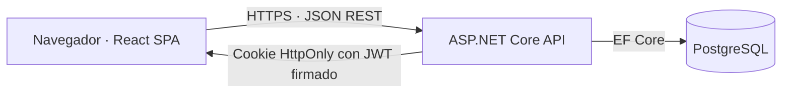

# Arquitectura de integración

## Visión general

La SPA no accede a la base de datos. Consume `/api/v1/*` y la API concentra autenticación, autorización, validación y reglas de negocio. Nginx sirve los recursos estáticos y reenvía `/api` al backend en Docker; Vite realiza el mismo proxy durante desarrollo.

## Sesión y roles

`POST /api/v1/auth/login` devuelve el usuario efectivo y la caducidad, mientras entrega el JWT en la cookie `transitops_session` con `HttpOnly`, `SameSite=Strict` y `Secure` fuera de desarrollo y pruebas locales. El token contiene `sub`, `unique_name`, `email`, `role` y `token_version`; la API valida firma, emisor, audiencia, caducidad, estado activo y versión en cada ruta protegida. Cambiar contraseña, desactivar la cuenta o cambiar el rol incrementa `TokenVersion` e invalida inmediatamente los JWT anteriores.

La SPA no lee ni persiste el token: envía la cookie de mismo origen, reconstruye su estado con `GET /api/v1/auth/me` al recargar y lo borra mediante `POST /api/v1/auth/logout`. La cookie `HttpOnly` reduce la exposición del JWT ante XSS, a cambio de introducir superficie CSRF; `SameSite=Strict` y la operación en mismo origen impiden que navegaciones o formularios de terceros adjunten la sesión. Se descartan *refresh tokens*: para el volumen previsto, una consulta ligera de usuario por petición ofrece invalidación inmediata con menos estados y endpoints que proteger.

## Contrato HTTP y errores

Los éxitos usan `{ "data": ..., "requestId": "..." }`. Los fallos usan `{ "error": { "code": "...", "message": "...", "details": ... }, "requestId": "..." }`. El código permite tratamiento estable en frontend, el mensaje es legible y `requestId` correlaciona respuesta y logs. La API aplica el mismo formato a validación (400), autenticación (401), autorización (403), conflictos (409) y errores inesperados (500).

## Arranque inicial

`POST /api/v1/auth/bootstrap-admin` requiere `X-Bootstrap-Token` configurado fuera del código. Solo crea un administrador si no existe otro administrador activo. A partir de ese momento el endpoint devuelve conflicto y los usuarios se gestionarán mediante RF-04.
